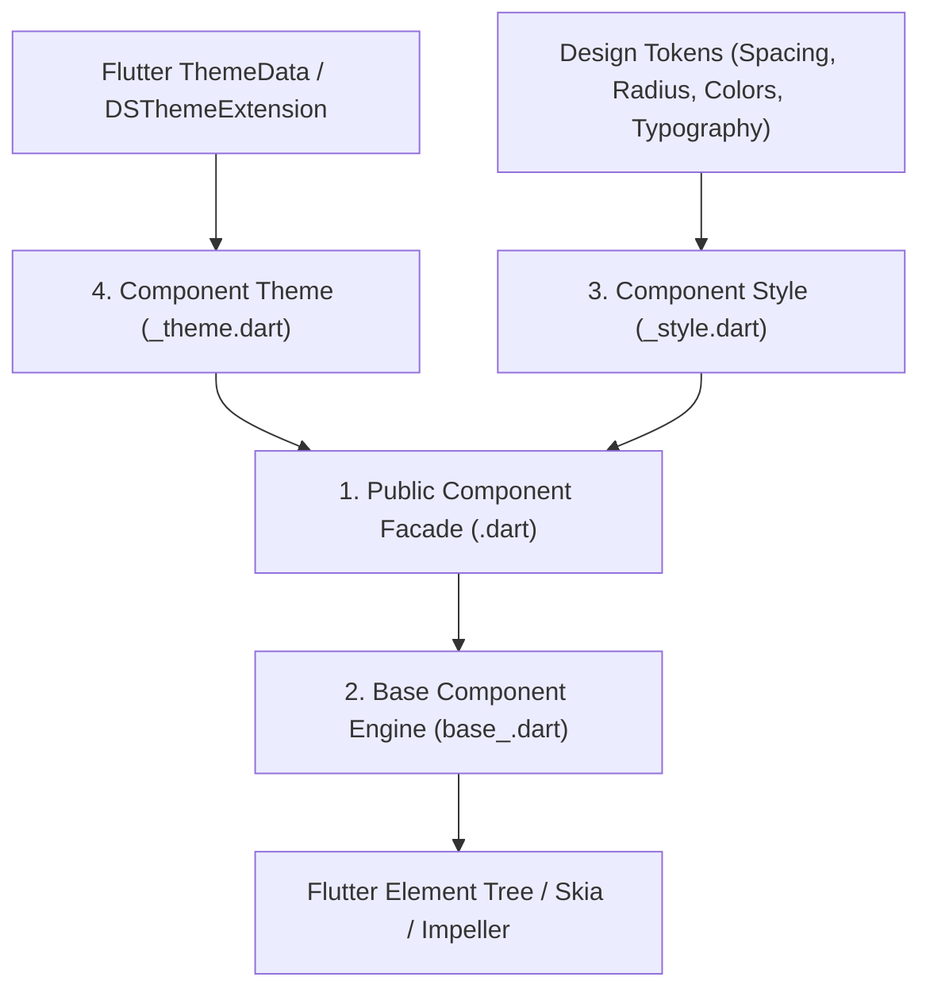
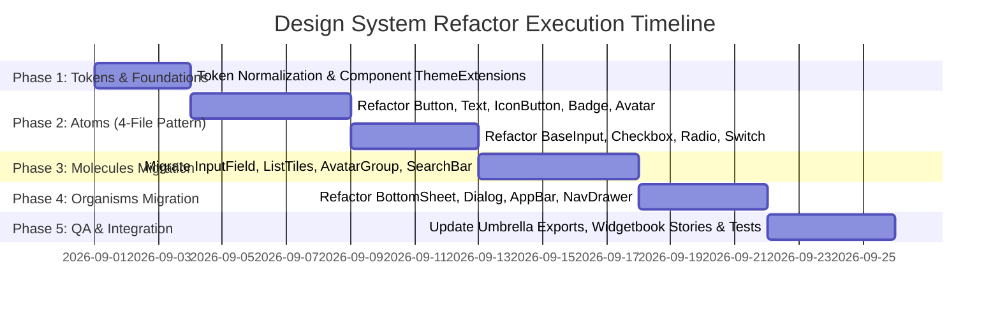

# Production-Grade Flutter Design System Architecture Blueprint & Refactor Plan

> **Authoritative Specification & Execution Blueprint**  
> Target Repository: `awesome_design_system`  
> Monorepo Structure: `packages/tokens` → `packages/atoms` → `packages/molecules` → `packages/organisms`

---

## 1. Executive Summary & Current State Audit

A thorough audit of `packages/tokens`, `packages/atoms`, `packages/molecules`, and `packages/organisms` identified several critical architectural and coding-standard violations that prevent this design system from functioning as a scalable, maintainable, production-grade Flutter design system.

### Key Deficiencies Identified

| Severity | Category | Issue Description | Affected Files |
|---|---|---|---|
| **CRITICAL** | **Token Bypass** | Widespread usage of raw Flutter `Text()`, `TextButton()`, `IconButton()`, and hardcoded `TextStyle(fontSize: 20, color: Colors.grey)` instead of design system atoms and tokens. | `bottom_sheet.dart`, `dialog.dart`, `app_bar.dart`, `checkbox.dart`, `radio.dart`, `select.dart`, `snackbar.dart`, `avatar.dart` |
| **CRITICAL** | **Anti-Pattern** | Use of private functional widget helper methods (`_buildStandard()`, `_buildCrossType()`, `_buildButton()`, `_buildImage()`) instead of dedicated `StatelessWidget` / `StatefulWidget` classes. | `bottom_sheet.dart`, `avatar.dart`, `button.dart`, `input.dart` |
| **HIGH** | **File Bloat** | Monolithic single files exceeding 400–670 lines containing multiple unrelated widgets, helper structs, enums, and private rendering logic without modular separation. | `input.dart` (673 lines), `avatar.dart` (604 lines), `button.dart` (481 lines), `card.dart` (399 lines), `text.dart` (412 lines) |
| **HIGH** | **Layer Misplacement** | Composite multi-atom components are located in `packages/atoms`, leaving `packages/molecules` and `packages/organisms` as empty shells. | `DSCheckboxListTile`, `DSRadioListTile`, `DSAvatarGroup`, `DSAvatarWithPresence`, `DSCardHeader`, `DSCardActions`, `DSBottomSheet`, `DSDialog` |
| **HIGH** | **Rigid / Broken APIs** | Non-configurable hardcoded strings (`'Primary'`, `'Secondary'`, `'Tertiary'`), horizontal `Row` overflow risks on action buttons, hardcoded empty callbacks (`() {}`), and unused parameters (`elevation`). | `bottom_sheet.dart`, `snackbar.dart` |
| **MEDIUM** | **Theming Inconsistency** | Inconsistent theme consumption: some components access `DsColors.of(context)` directly, others use `Theme.of(context).extension<DesignTokens>()`, and others fall back to hardcoded defaults without theme override capabilities. | Across all atom components |

---

## 2. Target Architecture: The 4-File Component Pattern

Every production component in the design system (atoms, molecules, organisms) must adhere to a strict **4-File Modular Pattern** inside its own dedicated directory. This replaces oversized monolithic files with clean, testable, themeable modules.

```
packages/<layer>/lib/src/<component_name>/
├── <component_name>.dart             # 1. Public API / Facade Widget
├── base_<component_name>.dart        # 2. Base / Internal Presentation & Layout Engine
├── <component_name>_style.dart       # 3. Immutable Style Data Object
├── <component_name>_theme.dart       # 4. ThemeExtension for Runtime Theming
└── index.dart                        # Barrel export for the component module
```

### Purpose of Each File



1. **`<component_name>_style.dart` (Style Data Model)**:
   - Holds all visual and layout attributes (e.g., `backgroundColor`, `foregroundColor`, `padding`, `borderRadius`, `borderSide`, `textStyle`, `elevation`, `iconSize`).
   - Pure Dart data class. Must implement `copyWith()` and `lerp()`.
   - Never depends on `BuildContext`.

2. **`<component_name>_theme.dart` (Theme Extension & Provider)**:
   - Implements `ThemeExtension<DS<Component>ThemeData>`.
   - Provides default styling for light and dark modes derived directly from `DesignTokens`.
   - Allows application developers to override default component styles globally or locally using `ThemeData(extensions: [...])`.

3. **`base_<component_name>.dart` (Base / Presentation Engine)**:
   - Handles the raw layout, interaction state transitions (`hovered`, `focused`, `pressed`, `disabled`, `loading`), gesture recognizers, and geometry.
   - Consumes resolved `<Component>Style` and renders the exact widget tree without business logic.

4. **`<component_name>.dart` (Public Facade Widget)**:
   - The developer-facing API (`DSButton`, `DSBottomSheet`, `DSText`, etc.).
   - Accepts semantic props, variant enums, callbacks, and an optional `style` override.
   - Resolves style hierarchy: `Widget Style Override > Local Theme Extension > Global Design Tokens > Default Fallback`.
   - Applies accessibility (`Semantics`), asserts invariants, and populates `debugFillProperties`.

5. **`index.dart`**:
   - Re-exports the public facade, style, and theme classes for clean imports.

---

## 3. Atomic Design Hierarchy & Package Boundary Blueprint

```
┌─────────────────────────────────────────────────────────────────────────┐
│                           ORGANISMS LAYER                               │
│  (Complex UI modules: DSBottomSheet, DSDialog, DSAppBar, DSDataTable)   │
└────────────────────────────────────┬────────────────────────────────────┘
                                     │ consumes
┌────────────────────────────────────▼────────────────────────────────────┐
│                           MOLECULES LAYER                               │
│   (Composite units: DSFormField, DSCheckboxTile, DSAvatarGroup, etc.)   │
└────────────────────────────────────┬────────────────────────────────────┘
                                     │ consumes
┌────────────────────────────────────▼────────────────────────────────────┐
│                             ATOMS LAYER                                 │
│      (Primitives: DSText, DSButton, DSIcon, DSBadge, DSAvatar, etc.)     │
└────────────────────────────────────┬────────────────────────────────────┘
                                     │ consumes
┌────────────────────────────────────▼────────────────────────────────────┐
│                            TOKENS LAYER                                 │
│  (Values: Colors, TypographyScale, SpacingScale, RadiusScale, Elevation)│
└─────────────────────────────────────────────────────────────────────────┘
```

### Layer Rules & Isolation Criteria

| Package | Allowed Imports | Forbidden Imports | Responsibilities |
|---|---|---|---|
| **`packages/tokens`** | Flutter `dart:ui`, `foundation`, `material` (token classes only) | `atoms`, `molecules`, `organisms` | Primitive scales, color palettes, spacing, sizing, radius, typography scales, elevation, breakpoints. Pure token models and `DesignTokens` aggregate. |
| **`packages/atoms`** | `tokens` | `molecules`, `organisms`, raw Flutter components where an atom exists | Indivisible building blocks: `DSText`, `DSButton`, `DSIconButton`, `DSIcon`, `DSAvatar`, `DSBadge`, `DSCheckbox`, `DSRadio`, `DSSwitch`, `DSSpacer`, `DSDivider`, `DSSpinner`. |
| **`packages/molecules`** | `tokens`, `atoms` | `organisms` | Combinations of atoms operating as a unit: `DSInputField`, `DSSelectField`, `DSCheckboxListTile`, `DSRadioListTile`, `DSSwitchListTile`, `DSAvatarGroup`, `DSAvatarWithPresence`, `DSCardHeader`, `DSCardActions`, `DSSearchBar`, `DSButtonGroup`, `DSToast`. |
| **`packages/organisms`** | `tokens`, `atoms`, `molecules` | None (Top Layer) | Distinct, high-level UI sections: `DSBottomSheet`, `DSDialog`, `DSAppBar`, `DSNavigationDrawer`, `DSBanner`, `DSDataTable`, `DSFilterPanel`. |

---

## 4. Exemplary Reference Implementations (4-File Pattern)

### Example 1: `DSButton` (Atom)

#### 1. `packages/atoms/lib/src/button/button_style.dart`
```dart
import 'dart:ui';
import 'package:flutter/foundation.dart';
import 'package:flutter/material.dart';

/// Immutable style parameters for [DSButton].
@immutable
class DSButtonStyle with Diagnosticable {
  const DSButtonStyle({
    this.backgroundColor,
    this.foregroundColor,
    this.disabledBackgroundColor,
    this.disabledForegroundColor,
    this.overlayColor,
    this.shadowColor,
    this.elevation,
    this.padding,
    this.minimumSize,
    this.borderRadius,
    this.borderSide,
    this.textStyle,
    this.iconSize,
    this.spacing,
  });

  final Color? backgroundColor;
  final Color? foregroundColor;
  final Color? disabledBackgroundColor;
  final Color? disabledForegroundColor;
  final Color? overlayColor;
  final Color? shadowColor;
  final double? elevation;
  final EdgeInsetsGeometry? padding;
  final Size? minimumSize;
  final BorderRadius? borderRadius;
  final BorderSide? borderSide;
  final TextStyle? textStyle;
  final double? iconSize;
  final double? spacing;

  DSButtonStyle copyWith({
    Color? backgroundColor,
    Color? foregroundColor,
    Color? disabledBackgroundColor,
    Color? disabledForegroundColor,
    Color? overlayColor,
    Color? shadowColor,
    double? elevation,
    EdgeInsetsGeometry? padding,
    Size? minimumSize,
    BorderRadius? borderRadius,
    BorderSide? borderSide,
    TextStyle? textStyle,
    double? iconSize,
    double? spacing,
  }) {
    return DSButtonStyle(
      backgroundColor: backgroundColor ?? this.backgroundColor,
      foregroundColor: foregroundColor ?? this.foregroundColor,
      disabledBackgroundColor: disabledBackgroundColor ?? this.disabledBackgroundColor,
      disabledForegroundColor: disabledForegroundColor ?? this.disabledForegroundColor,
      overlayColor: overlayColor ?? this.overlayColor,
      shadowColor: shadowColor ?? this.shadowColor,
      elevation: elevation ?? this.elevation,
      padding: padding ?? this.padding,
      minimumSize: minimumSize ?? this.minimumSize,
      borderRadius: borderRadius ?? this.borderRadius,
      borderSide: borderSide ?? this.borderSide,
      textStyle: textStyle ?? this.textStyle,
      iconSize: iconSize ?? this.iconSize,
      spacing: spacing ?? this.spacing,
    );
  }

  DSButtonStyle merge(DSButtonStyle? other) {
    if (other == null) return this;
    return copyWith(
      backgroundColor: other.backgroundColor,
      foregroundColor: other.foregroundColor,
      disabledBackgroundColor: other.disabledBackgroundColor,
      disabledForegroundColor: other.disabledForegroundColor,
      overlayColor: other.overlayColor,
      shadowColor: other.shadowColor,
      elevation: other.elevation,
      padding: other.padding,
      minimumSize: other.minimumSize,
      borderRadius: other.borderRadius,
      borderSide: other.borderSide,
      textStyle: other.textStyle,
      iconSize: other.iconSize,
      spacing: other.spacing,
    );
  }

  static DSButtonStyle? lerp(DSButtonStyle? a, DSButtonStyle? b, double t) {
    if (identical(a, b)) return a;
    return DSButtonStyle(
      backgroundColor: Color.lerp(a?.backgroundColor, b?.backgroundColor, t),
      foregroundColor: Color.lerp(a?.foregroundColor, b?.foregroundColor, t),
      disabledBackgroundColor: Color.lerp(a?.disabledBackgroundColor, b?.disabledBackgroundColor, t),
      disabledForegroundColor: Color.lerp(a?.disabledForegroundColor, b?.disabledForegroundColor, t),
      overlayColor: Color.lerp(a?.overlayColor, b?.overlayColor, t),
      shadowColor: Color.lerp(a?.shadowColor, b?.shadowColor, t),
      elevation: lerpDouble(a?.elevation, b?.elevation, t),
      padding: EdgeInsetsGeometry.lerp(a?.padding, b?.padding, t),
      borderRadius: BorderRadius.lerp(a?.borderRadius, b?.borderRadius, t),
      borderSide: BorderSide.lerp(a?.borderSide ?? BorderSide.none, b?.borderSide ?? BorderSide.none, t),
      textStyle: TextStyle.lerp(a?.textStyle, b?.textStyle, t),
      iconSize: lerpDouble(a?.iconSize, b?.iconSize, t),
      spacing: lerpDouble(a?.spacing, b?.spacing, t),
    );
  }
}
```

#### 2. `packages/atoms/lib/src/button/button_theme.dart`
```dart
import 'package:flutter/material.dart';
import 'package:awesome_design_system_tokens/tokens.dart';
import 'button_style.dart';

/// ThemeExtension for button styling across the design system.
@immutable
class DSButtonThemeData extends ThemeExtension<DSButtonThemeData> {
  const DSButtonThemeData({
    required this.filledStyle,
    required this.outlinedStyle,
    required this.elevatedStyle,
    required this.tonalStyle,
    required this.textStyle,
  });

  factory DSButtonThemeData.fromTokens(DesignTokens tokens, ColorScheme colors) {
    final SpacingScale spacing = tokens.spacing.scale;
    final RadiusScale radius = tokens.radius.scale;
    final SizingScale sizing = tokens.sizing.scale;
    final TypographyScale typo = tokens.typography.scale;

    return DSButtonThemeData(
      filledStyle: DSButtonStyle(
        backgroundColor: colors.primary,
        foregroundColor: colors.onPrimary,
        disabledBackgroundColor: colors.surfaceContainerHighest,
        disabledForegroundColor: colors.onSurfaceVariant,
        padding: EdgeInsets.symmetric(horizontal: spacing.md, vertical: spacing.xs),
        borderRadius: radius.mdRadius,
        minimumSize: Size(64, sizing.buttonHeightMd),
        textStyle: typo.labelLarge,
        iconSize: sizing.iconMd,
        spacing: spacing.xs,
      ),
      outlinedStyle: DSButtonStyle(
        backgroundColor: Colors.transparent,
        foregroundColor: colors.primary,
        disabledBackgroundColor: Colors.transparent,
        disabledForegroundColor: colors.onSurfaceVariant,
        borderSide: BorderSide(color: colors.outline),
        padding: EdgeInsets.symmetric(horizontal: spacing.md, vertical: spacing.xs),
        borderRadius: radius.mdRadius,
        minimumSize: Size(64, sizing.buttonHeightMd),
        textStyle: typo.labelLarge,
        iconSize: sizing.iconMd,
        spacing: spacing.xs,
      ),
      elevatedStyle: DSButtonStyle(
        backgroundColor: colors.surfaceContainerLow,
        foregroundColor: colors.primary,
        disabledBackgroundColor: colors.surfaceContainerHighest,
        disabledForegroundColor: colors.onSurfaceVariant,
        elevation: 1,
        shadowColor: colors.shadow,
        padding: EdgeInsets.symmetric(horizontal: spacing.md, vertical: spacing.xs),
        borderRadius: radius.mdRadius,
        minimumSize: Size(64, sizing.buttonHeightMd),
        textStyle: typo.labelLarge,
        iconSize: sizing.iconMd,
        spacing: spacing.xs,
      ),
      tonalStyle: DSButtonStyle(
        backgroundColor: colors.secondaryContainer,
        foregroundColor: colors.onSecondaryContainer,
        disabledBackgroundColor: colors.surfaceContainerHighest,
        disabledForegroundColor: colors.onSurfaceVariant,
        padding: EdgeInsets.symmetric(horizontal: spacing.md, vertical: spacing.xs),
        borderRadius: radius.mdRadius,
        minimumSize: Size(64, sizing.buttonHeightMd),
        textStyle: typo.labelLarge,
        iconSize: sizing.iconMd,
        spacing: spacing.xs,
      ),
      textStyle: DSButtonStyle(
        backgroundColor: Colors.transparent,
        foregroundColor: colors.primary,
        disabledBackgroundColor: Colors.transparent,
        disabledForegroundColor: colors.onSurfaceVariant,
        padding: EdgeInsets.symmetric(horizontal: spacing.sm, vertical: spacing.xs),
        borderRadius: radius.mdRadius,
        minimumSize: Size(48, sizing.buttonHeightSm),
        textStyle: typo.labelLarge,
        iconSize: sizing.iconMd,
        spacing: spacing.xs,
      ),
    );
  }

  final DSButtonStyle filledStyle;
  final DSButtonStyle outlinedStyle;
  final DSButtonStyle elevatedStyle;
  final DSButtonStyle tonalStyle;
  final DSButtonStyle textStyle;

  @override
  DSButtonThemeData copyWith({
    DSButtonStyle? filledStyle,
    DSButtonStyle? outlinedStyle,
    DSButtonStyle? elevatedStyle,
    DSButtonStyle? tonalStyle,
    DSButtonStyle? textStyle,
  }) {
    return DSButtonThemeData(
      filledStyle: filledStyle ?? this.filledStyle,
      outlinedStyle: outlinedStyle ?? this.outlinedStyle,
      elevatedStyle: elevatedStyle ?? this.elevatedStyle,
      tonalStyle: tonalStyle ?? this.tonalStyle,
      textStyle: textStyle ?? this.textStyle,
    );
  }

  @override
  DSButtonThemeData lerp(ThemeExtension<DSButtonThemeData>? other, double t) {
    if (other is! DSButtonThemeData) return this;
    return DSButtonThemeData(
      filledStyle: DSButtonStyle.lerp(filledStyle, other.filledStyle, t)!,
      outlinedStyle: DSButtonStyle.lerp(outlinedStyle, other.outlinedStyle, t)!,
      elevatedStyle: DSButtonStyle.lerp(elevatedStyle, other.elevatedStyle, t)!,
      tonalStyle: DSButtonStyle.lerp(tonalStyle, other.tonalStyle, t)!,
      textStyle: DSButtonStyle.lerp(textStyle, other.textStyle, t)!,
    );
  }
}
```

#### 3. `packages/atoms/lib/src/button/base_button.dart`
```dart
import 'package:flutter/material.dart';
import 'button_style.dart';

/// Low-level presentation widget for rendering clickable button geometry and content.
class DSBaseButton extends StatelessWidget {
  const DSBaseButton({
    required this.onPressed,
    required this.style,
    required this.child,
    super.key,
    this.onLongPress,
    this.leadingIcon,
    this.trailingIcon,
    this.isLoading = false,
    this.fullWidth = false,
  });

  final VoidCallback? onPressed;
  final VoidCallback? onLongPress;
  final DSButtonStyle style;
  final Widget child;
  final Widget? leadingIcon;
  final Widget? trailingIcon;
  final bool isLoading;
  final bool fullWidth;

  @override
  Widget build(BuildContext context) {
    final bool isEnabled = onPressed != null || onLongPress != null;
    final Color effectiveBackground = isEnabled
        ? (style.backgroundColor ?? Colors.transparent)
        : (style.disabledBackgroundColor ?? Colors.transparent);
    final Color effectiveForeground = isEnabled
        ? (style.foregroundColor ?? Theme.of(context).colorScheme.onSurface)
        : (style.disabledForegroundColor ?? Theme.of(context).colorScheme.onSurfaceVariant);

    Widget content = _DSButtonContent(
      textStyle: style.textStyle?.copyWith(color: effectiveForeground),
      iconSize: style.iconSize ?? 18.0,
      spacing: style.spacing ?? 8.0,
      leadingIcon: leadingIcon,
      trailingIcon: trailingIcon,
      isLoading: isLoading,
      loadingColor: effectiveForeground,
      child: child,
    );

    Widget button = Material(
      color: effectiveBackground,
      elevation: isEnabled ? (style.elevation ?? 0.0) : 0.0,
      shadowColor: style.shadowColor,
      shape: RoundedRectangleBorder(
        borderRadius: style.borderRadius ?? BorderRadius.zero,
        side: isEnabled ? (style.borderSide ?? BorderSide.none) : BorderSide.none,
      ),
      child: InkWell(
        onTap: isLoading ? null : onPressed,
        onLongPress: isLoading ? null : onLongPress,
        borderRadius: style.borderRadius,
        child: ConstrainedBox(
          constraints: BoxConstraints(
            minWidth: style.minimumSize?.width ?? 0.0,
            minHeight: style.minimumSize?.height ?? 0.0,
          ),
          child: Padding(
            padding: style.padding ?? EdgeInsets.zero,
            child: content,
          ),
        ),
      ),
    );

    if (fullWidth) {
      button = SizedBox(width: double.infinity, child: button);
    }

    return button;
  }
}

class _DSButtonContent extends StatelessWidget {
  const _DSButtonContent({
    required this.child,
    required this.iconSize,
    required this.spacing,
    required this.isLoading,
    required this.loadingColor,
    this.textStyle,
    this.leadingIcon,
    this.trailingIcon,
  });

  final Widget child;
  final TextStyle? textStyle;
  final double iconSize;
  final double spacing;
  final bool isLoading;
  final Color loadingColor;
  final Widget? leadingIcon;
  final Widget? trailingIcon;

  @override
  Widget build(BuildContext context) {
    if (isLoading) {
      return Center(
        mainAxisSize: MainAxisSize.min,
        child: SizedBox(
          width: iconSize,
          height: iconSize,
          child: CircularProgressIndicator(
            strokeWidth: 2,
            valueColor: AlwaysStoppedAnimation<Color>(loadingColor),
          ),
        ),
      );
    }

    return Row(
      mainAxisSize: MainAxisSize.min,
      mainAxisAlignment: MainAxisAlignment.center,
      children: <Widget>[
        if (leadingIcon != null) ...<Widget>[
          SizedBox(width: iconSize, height: iconSize, child: leadingIcon),
          SizedBox(width: spacing),
        ],
        DefaultTextStyle(
          style: textStyle ?? DefaultTextStyle.of(context).style,
          child: child,
        ),
        if (trailingIcon != null) ...<Widget>[
          SizedBox(width: spacing),
          SizedBox(width: iconSize, height: iconSize, child: trailingIcon),
        ],
      ],
    );
  }
}
```

#### 4. `packages/atoms/lib/src/button/button.dart`
```dart
import 'package:flutter/foundation.dart';
import 'package:flutter/material.dart';
import 'package:awesome_design_system_tokens/tokens.dart';
import 'button_style.dart';
import 'button_theme.dart';
import 'base_button.dart';

/// Semantic visual variants for [DSButton].
enum DSButtonVariant { filled, outlined, elevated, tonal, text }

/// Semantic sizes for [DSButton].
enum DSButtonSize { small, medium, large }

/// Production-grade button atom supporting variants, theming, and accessibility.
class DSButton extends StatelessWidget {
  const DSButton({
    required this.onPressed,
    required this.child,
    super.key,
    this.variant = DSButtonVariant.filled,
    this.size = DSButtonSize.medium,
    this.leadingIcon,
    this.trailingIcon,
    this.isLoading = false,
    this.isDisabled = false,
    this.fullWidth = false,
    this.semanticLabel,
    this.tooltip,
    this.onLongPress,
    this.style,
  });

  /// Convenience constructor for text-labeled buttons
  factory DSButton.label({
    required String label,
    required VoidCallback? onPressed,
    Key? key,
    DSButtonVariant variant = DSButtonVariant.filled,
    DSButtonSize size = DSButtonSize.medium,
    Widget? leadingIcon,
    Widget? trailingIcon,
    bool isLoading = false,
    bool isDisabled = false,
    bool fullWidth = false,
    String? semanticLabel,
    String? tooltip,
    VoidCallback? onLongPress,
    DSButtonStyle? style,
  }) {
    return DSButton(
      key: key,
      onPressed: onPressed,
      variant: variant,
      size: size,
      leadingIcon: leadingIcon,
      trailingIcon: trailingIcon,
      isLoading: isLoading,
      isDisabled: isDisabled,
      fullWidth: fullWidth,
      semanticLabel: semanticLabel,
      tooltip: tooltip,
      onLongPress: onLongPress,
      style: style,
      child: Text(label),
    );
  }

  final VoidCallback? onPressed;
  final VoidCallback? onLongPress;
  final Widget child;
  final DSButtonVariant variant;
  final DSButtonSize size;
  final Widget? leadingIcon;
  final Widget? trailingIcon;
  final bool isLoading;
  final bool isDisabled;
  final bool fullWidth;
  final String? semanticLabel;
  final String? tooltip;
  final DSButtonStyle? style;

  @override
  Widget build(BuildContext context) {
    final DSButtonThemeData? theme = Theme.of(context).extension<DSButtonThemeData>();
    final DesignTokens? tokens = Theme.of(context).extension<DesignTokens>();
    final ColorScheme colors = Theme.of(context).colorScheme;

    // Fallback theme builder if extension not provided
    final DSButtonThemeData effectiveTheme = theme ?? 
        (tokens != null 
            ? DSButtonThemeData.fromTokens(tokens, colors)
            : DSButtonThemeData.fromTokens(DesignTokens.light(brandPrimary: colors.primary), colors));

    final DSButtonStyle baseVariantStyle = switch (variant) {
      DSButtonVariant.filled => effectiveTheme.filledStyle,
      DSButtonVariant.outlined => effectiveTheme.outlinedStyle,
      DSButtonVariant.elevated => effectiveTheme.elevatedStyle,
      DSButtonVariant.tonal => effectiveTheme.tonalStyle,
      DSButtonVariant.text => effectiveTheme.textStyle,
    };

    final DSButtonStyle effectiveStyle = baseVariantStyle.merge(style);
    final VoidCallback? effectiveOnPressed = (isDisabled || isLoading) ? null : onPressed;
    final VoidCallback? effectiveOnLongPress = (isDisabled || isLoading) ? null : onLongPress;

    Widget button = DSBaseButton(
      onPressed: effectiveOnPressed,
      onLongPress: effectiveOnLongPress,
      style: effectiveStyle,
      leadingIcon: leadingIcon,
      trailingIcon: trailingIcon,
      isLoading: isLoading,
      fullWidth: fullWidth,
      child: child,
    );

    if (tooltip != null) {
      button = Tooltip(message: tooltip!, child: button);
    }

    if (semanticLabel != null) {
      button = Semantics(
        label: semanticLabel,
        button: true,
        enabled: effectiveOnPressed != null,
        child: button,
      );
    }

    return button;
  }

  @override
  void debugFillProperties(DiagnosticPropertiesBuilder properties) {
    super.debugFillProperties(properties);
    properties.add(EnumProperty<DSButtonVariant>('variant', variant));
    properties.add(EnumProperty<DSButtonSize>('size', size));
    properties.add(DiagnosticsProperty<bool>('isLoading', isLoading));
    properties.add(DiagnosticsProperty<bool>('isDisabled', isDisabled));
    properties.add(DiagnosticsProperty<bool>('fullWidth', fullWidth));
    properties.add(StringProperty('semanticLabel', semanticLabel));
    properties.add(StringProperty('tooltip', tooltip));
  }
}
```

---

### Example 2: `DSBottomSheet` (Organism)

In accordance with the Atomic Design hierarchy, `DSBottomSheet` is an **Organism** residing in `packages/organisms/lib/src/bottom_sheet/`.

#### Action Model Definition (`bottom_sheet_action.dart`)
```dart
import 'package:flutter/material.dart';
import 'package:awesome_design_system_atoms/atoms.dart';

/// Typed action definition for [DSBottomSheet].
class DSBottomSheetAction {
  const DSBottomSheetAction({
    required this.label,
    required this.onPressed,
    this.variant = DSButtonVariant.filled,
    this.leadingIcon,
    this.isLoading = false,
    this.isDestructive = false,
  });

  final String label;
  final VoidCallback? onPressed;
  final DSButtonVariant variant;
  final Widget? leadingIcon;
  final bool isLoading;
  final bool isDestructive;
}
```

#### Refactored `DSBottomSheet` (`bottom_sheet.dart`)
```dart
import 'package:flutter/foundation.dart';
import 'package:flutter/material.dart';
import 'package:awesome_design_system_tokens/tokens.dart';
import 'package:awesome_design_system_atoms/atoms.dart';
import 'bottom_sheet_action.dart';

/// A production-grade bottom sheet organism following Material 3 guidelines.
class DSBottomSheet extends StatelessWidget {
  const DSBottomSheet({
    required this.title,
    super.key,
    this.description,
    this.content,
    this.actions = const <DSBottomSheetAction>[],
    this.showCloseButton = true,
    this.showDragHandle = true,
    this.onClosePressed,
    this.backgroundColor,
  });

  final String title;
  final String? description;
  final Widget? content;
  final List<DSBottomSheetAction> actions;
  final bool showCloseButton;
  final bool showDragHandle;
  final VoidCallback? onClosePressed;
  final Color? backgroundColor;

  @override
  Widget build(BuildContext context) {
    final DesignTokens? tokens = Theme.of(context).extension<DesignTokens>();
    final SpacingScale spacing = tokens?.spacing.scale ?? SpacingScale.defaultScale;
    final RadiusScale radius = tokens?.radius.scale ?? RadiusScale.defaultScale;
    final ColorScheme colors = Theme.of(context).colorScheme;

    return Container(
      decoration: BoxDecoration(
        color: backgroundColor ?? colors.surface,
        borderRadius: BorderRadius.vertical(top: Radius.circular(radius.xl)),
      ),
      child: SafeArea(
        top: false,
        child: Padding(
          padding: EdgeInsets.symmetric(horizontal: spacing.lg, vertical: spacing.md),
          child: Column(
            mainAxisSize: MainAxisSize.min,
            crossAxisAlignment: CrossAxisAlignment.stretch,
            children: <Widget>[
              if (showDragHandle) const _DSDragHandle(),
              _DSBottomSheetHeader(
                title: title,
                description: description,
                showCloseButton: showCloseButton,
                onClosePressed: onClosePressed ?? () => Navigator.of(context).maybePop(),
              ),
              if (content != null) ...<Widget>[
                SizedBox(height: spacing.md),
                Flexible(child: SingleChildScrollView(child: content!)),
              ],
              if (actions.isNotEmpty) ...<Widget>[
                SizedBox(height: spacing.lg),
                _DSBottomSheetActionsColumn(actions: actions, spacing: spacing.sm),
              ],
            ],
          ),
        ),
      ),
    );
  }
}

class _DSDragHandle extends StatelessWidget {
  const _DSDragHandle();

  @override
  Widget build(BuildContext context) {
    final ColorScheme colors = Theme.of(context).colorScheme;
    return Center(
      child: Container(
        margin: const EdgeInsets.only(bottom: 12.0),
        width: 32,
        height: 4,
        decoration: BoxDecoration(
          color: colors.onSurfaceVariant.withValues(alpha: 0.4),
          borderRadius: BorderRadius.circular(2),
        ),
      ),
    );
  }
}

class _DSBottomSheetHeader extends StatelessWidget {
  const _DSBottomSheetHeader({
    required this.title,
    required this.showCloseButton,
    required this.onClosePressed,
    this.description,
  });

  final String title;
  final String? description;
  final bool showCloseButton;
  final VoidCallback onClosePressed;

  @override
  Widget build(BuildContext context) {
    final DesignTokens? tokens = Theme.of(context).extension<DesignTokens>();
    final SpacingScale spacing = tokens?.spacing.scale ?? SpacingScale.defaultScale;

    return Row(
      crossAxisAlignment: CrossAxisAlignment.start,
      children: <Widget>[
        Expanded(
          child: Column(
            crossAxisAlignment: CrossAxisAlignment.start,
            mainAxisSize: MainAxisSize.min,
            children: <Widget>[
              DSText(title, variant: TextVariant.titleLarge),
              if (description != null) ...<Widget>[
                SizedBox(height: spacing.xxs),
                DSText(description!, variant: TextVariant.bodyMedium, colorRole: TextColorRole.secondary),
              ],
            ],
          ),
        ),
        if (showCloseButton)
          DSIconButton(
            onPressed: onClosePressed,
            icon: const Icon(Icons.close),
            size: ButtonSize.small,
          ),
      ],
    );
  }
}

class _DSBottomSheetActionsColumn extends StatelessWidget {
  const _DSBottomSheetActionsColumn({
    required this.actions,
    required this.spacing,
  });

  final List<DSBottomSheetAction> actions;
  final double spacing;

  @override
  Widget build(BuildContext context) {
    return Column(
      mainAxisSize: MainAxisSize.min,
      crossAxisAlignment: CrossAxisAlignment.stretch,
      children: actions.map((DSBottomSheetAction action) {
        return Padding(
          padding: EdgeInsets.only(bottom: spacing),
          child: DSButton(
            onPressed: action.onPressed,
            variant: action.variant,
            leadingIcon: action.leadingIcon,
            isLoading: action.isLoading,
            fullWidth: true,
            child: DSText(action.label),
          ),
        );
      }).toList(),
    );
  }
}
```

---

## 5. Comprehensive Audit & Remediation Plan by Component

### Package: `packages/tokens`

| Item | Current Issue | Remediation Plan |
|---|---|---|
| `design_tokens.dart` | Token extensions exist but component themes in `toLightThemeData()` are tightly bound and do not support granular component `ThemeExtension` overrides. | Register dedicated component `ThemeExtension` instances (e.g. `DSButtonThemeData`, `DSCardThemeData`, `DSTextThemeData`) inside `ThemeData.extensions`. |
| `ds_colors.dart` | Legacy color wrapper is used inconsistently across atoms instead of unified `ColorScheme` / `ColorTokens`. | Deprecate direct `DsColors.of(context)` usage across components and unify on `Theme.of(context).colorScheme` + `DesignTokens.colors`. |

---

### Package: `packages/atoms`

| Component | Current Anti-Patterns & Deficiencies | Target Architecture & Migration Steps |
|---|---|---|
| **`button.dart`** | Monolithic 481-line file combining `DSButton` and `DSIconButton`, internal style resolver methods. | Refactor into `packages/atoms/lib/src/button/` using 4-file pattern. Extract `DSIconButton` into `packages/atoms/lib/src/icon_button/`. |
| **`text.dart`** | Monolithic 412-line file containing `DSText`, `DSRichText`, `DSLink`, and `DSTextSpan`. | Refactor into `packages/atoms/lib/src/text/` using 4-file pattern. Extract `DSLink` into `packages/atoms/lib/src/link/`. Ensure all design system components dogfood `DSText`. |
| **`card.dart`** | 399-line file bundling `DSCard`, `DSCardHeader`, `DSCardActions`, `DSCardMedia`. | Retain `DSCard` as atom in `packages/atoms/lib/src/card/`. Migrate `DSCardHeader` and `DSCardActions` to `packages/molecules/lib/src/card/`. |
| **`input.dart`** | 673-line monolithic file bundling `DSInput`, `DSTextArea`, and `_RequiredIndicator`. | Split into `base_input.dart`, `input_style.dart`, `input_theme.dart`, `input.dart`. Move composite field wrapper (`_RequiredIndicator` + helper text) to `DSInputField` in `packages/molecules/`. |
| **`badge.dart`** | 374-line file with `DSBadge` and `DSStatusBadge`. Uses raw `Text()` instead of `DSText`. | Refactor `DSBadge` into 4-file pattern in `packages/atoms/lib/src/badge/`. Migrate `DSStatusBadge` (with icons & semantic statuses) to `packages/molecules/`. |
| **`avatar.dart`** | 604-line file with `DSAvatar`, `DSAvatarGroup`, `DSAvatarWithPresence`. Uses raw `Text()` and `_buildImage()` methods. | Retain `DSAvatar` in `packages/atoms/lib/src/avatar/`. Move `DSAvatarGroup` and `DSAvatarWithPresence` to `packages/molecules/`. Replace raw `Text` with `DSText`. |
| **`checkbox.dart`** | Contains `DSCheckboxListTile` (a molecule) and uses non-standard parameter name `thisEnabled`. Uses raw `Text()`. | Move `DSCheckboxListTile` to `packages/molecules/`. Refactor `DSCheckbox` to atom with standard `enabled` / `value` / `onChanged` API and `DSText`. |
| **`radio.dart`** | Contains `DSRadioListTile` (a molecule) and non-standard `thisEnabled`. | Move `DSRadioListTile` to `packages/molecules/`. Refactor `DSRadio` to atom. |
| **`select.dart`** | Direct `DropdownButtonFormField` with hardcoded raw `Text()` for items and hints. | Move `DSSelect` / `DSSelectField` to `packages/molecules/lib/src/select/` using 4-file pattern. |
| **`snackbar.dart`** | Misnamed `DSnackbar` instead of `DSSnackbar`. Contains dummy empty callback `onPressed: () {}`. Uses raw `Text()`. | Rename to `DSSnackbar`. Migrate to `packages/molecules/lib/src/snackbar/` or `organisms` with a proper `DSSnackbarMessenger` / `showDSSnackbar` helper. |
| **`app_bar.dart`** | Direct raw `Text()` and `IconButton()`. Rigid padding and leading logic. | Move to `packages/organisms/lib/src/app_bar/`. Use `DSText` and `DSIconButton`. Apply tokenized sizing and paddings. |
| **`dialog.dart`** | Direct raw `Text()` and `AlertDialog` wrapping without tokenized styling. | Move to `packages/organisms/lib/src/dialog/`. Use `DSText`, `DSButton`, and tokenized elevation/radius. |
| **`bottom_sheet.dart`** | Functional widget builders, hardcoded button labels, horizontal `Row` overflow, unused `elevation`. | Move to `packages/organisms/lib/src/bottom_sheet/`. Implement full refactor detailed in Section 4. |

---

### Package: `packages/molecules` (New Core Implementations)

The following components must be created or moved into `packages/molecules`:

1. **`DSInputField`**: Combines label (`DSText`), required asterisk, input field (`DSInput`), prefix/suffix icons, counter, and animated error/helper text.
2. **`DSCheckboxListTile`**: Accessible tile with `DSCheckbox` + title (`DSText`) + subtitle (`DSText`) + trailing icon.
3. **`DSRadioListTile`**: Accessible tile with `DSRadio` + title (`DSText`) + subtitle (`DSText`) + trailing icon.
4. **`DSSwitchListTile`**: Accessible tile with `DSSwitch` + title (`DSText`) + subtitle (`DSText`).
5. **`DSAvatarGroup`**: Stacked overlapping `DSAvatar` atoms with `+N` overflow counter indicator.
6. **`DSAvatarWithPresence`**: `DSAvatar` paired with online/away/busy status badge indicator.
7. **`DSButtonGroup`**: Segmented button / grouped action buttons with unified border styling.
8. **`DSSearchBar`**: Search input atom with embedded clear button, search icon, and debounce callback.

---

### Package: `packages/organisms` (New Core Implementations)

1. **`DSBottomSheet`**: Complete M3 bottom sheet modal with drag handle, title/description, content container, and stacked actions column.
2. **`DSDialog`**: Alert/confirmation modal dialog with header, body content, and tokenized primary/secondary action buttons.
3. **`DSAppBar`**: Responsive app bar supporting solid and lucid variants, title, leading navigation button, and action item overflow menu.
4. **`DSNavigationDrawer`**: Side navigation organism composing list tiles, dividers, headers, and active state badges.

---

## 6. Coding Standards & Implementation Checklist

All components across all packages must adhere to the following rules:

### Mandatory Coding Rules

- [ ] **No Functional Widget Helpers**: Never use `Widget _buildX() { ... }`. Always extract into dedicated `StatelessWidget` / `StatefulWidget` private or public classes.
- [ ] **Dogfooding Atoms**: Never use raw Flutter `Text()`, `TextButton()`, `ElevatedButton()`, or `IconButton()` inside design system components. Always use `DSText`, `DSButton`, and `DSIconButton`.
- [ ] **Zero Hardcoded Values**: All sizes, paddings, margins, colors, text styles, and radiuses must come from `DesignTokens` or `DSComponentStyle`.
- [ ] **Diagnostics Support**: Every widget must override `debugFillProperties(DiagnosticPropertiesBuilder properties)` and register all parameters.
- [ ] **Accessibility (A11y)**: Every interactive component must have semantic labels (`Semantics`) and meet minimum touch target constraints (48x48 dp).
- [ ] **Responsive Action Layout**: Action buttons in bottom sheets and dialogs must default to full-width vertical stacks (`Column`) or wrap responsively to eliminate `RenderFlex` overflow errors.
- [ ] **Immutable Theme Extensions**: All styling classes must be `@immutable`, provide `copyWith()`, and implement smooth interpolation in `lerp()`.

---

## 7. Phased Migration & Refactoring Roadmap



### Phase Breakdown

1. **Phase 1: Foundation & Token Normalization**
   - Register modular component `ThemeExtension` models in `DesignTokens`.
   - Normalize light/dark semantic color mappings and deprecate standalone `DsColors` references.

2. **Phase 2: Core Atoms Modularization**
   - Apply the 4-file pattern to all atoms in `packages/atoms`.
   - Remove all functional widget helper methods and raw Flutter `Text()` instances.

3. **Phase 3: Molecules Extraction & Population**
   - Populate `packages/molecules` by extracting composite components from `packages/atoms`.
   - Implement `DSInputField`, `DSCheckboxListTile`, `DSRadioListTile`, `DSAvatarGroup`, etc.

4. **Phase 4: Organisms Refactoring**
   - Move `DSBottomSheet`, `DSDialog`, `DSAppBar` to `packages/organisms`.
   - Implement typed action models, responsive action columns, and drag handles.

5. **Phase 5: Umbrella Verification & Documentation**
   - Update `lib/design_system.dart` exports.
   - Update Widgetbook stories in `widgetbook/lib/stories/` to reflect new APIs.
   - Run `melos analyze` and `melos test` across the monorepo to ensure 100% test pass and zero lint warnings.
